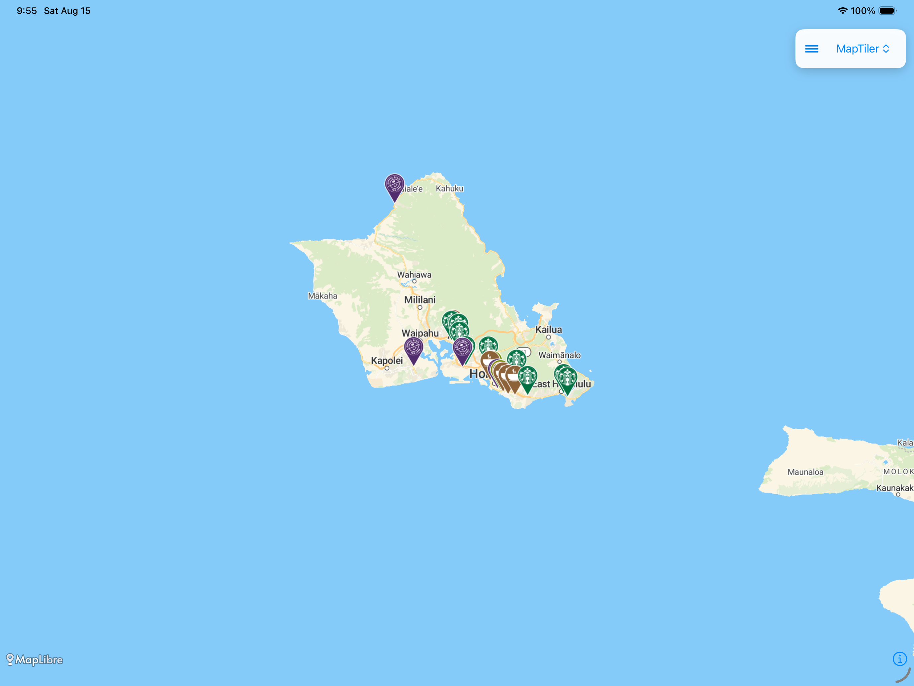
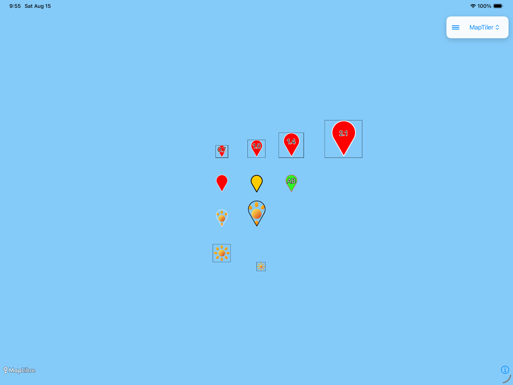
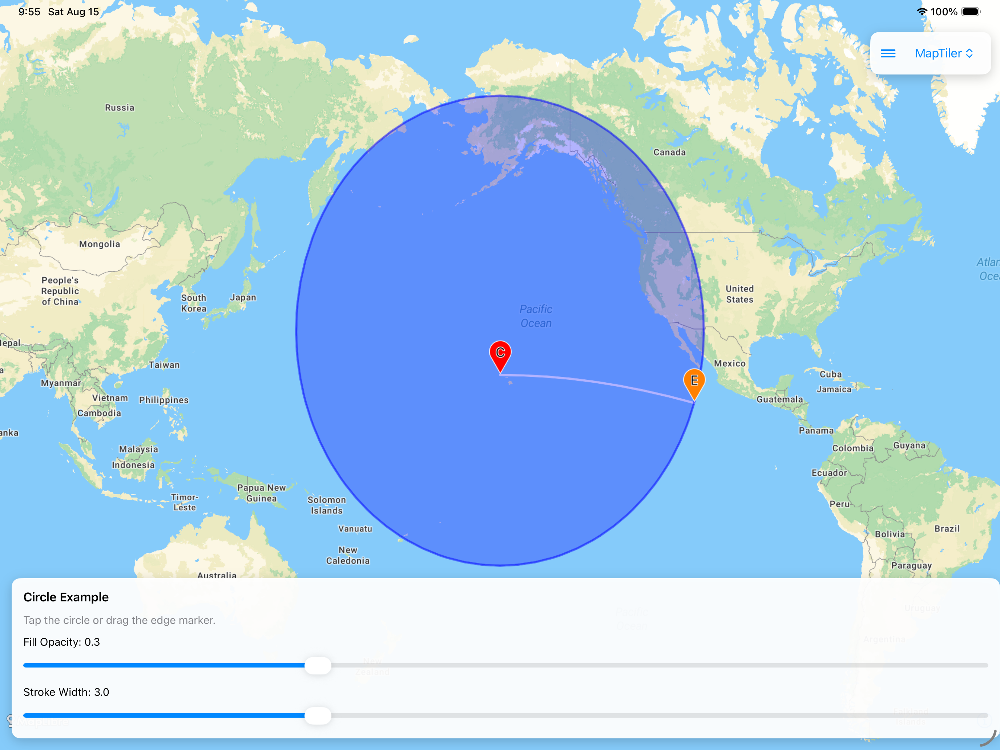
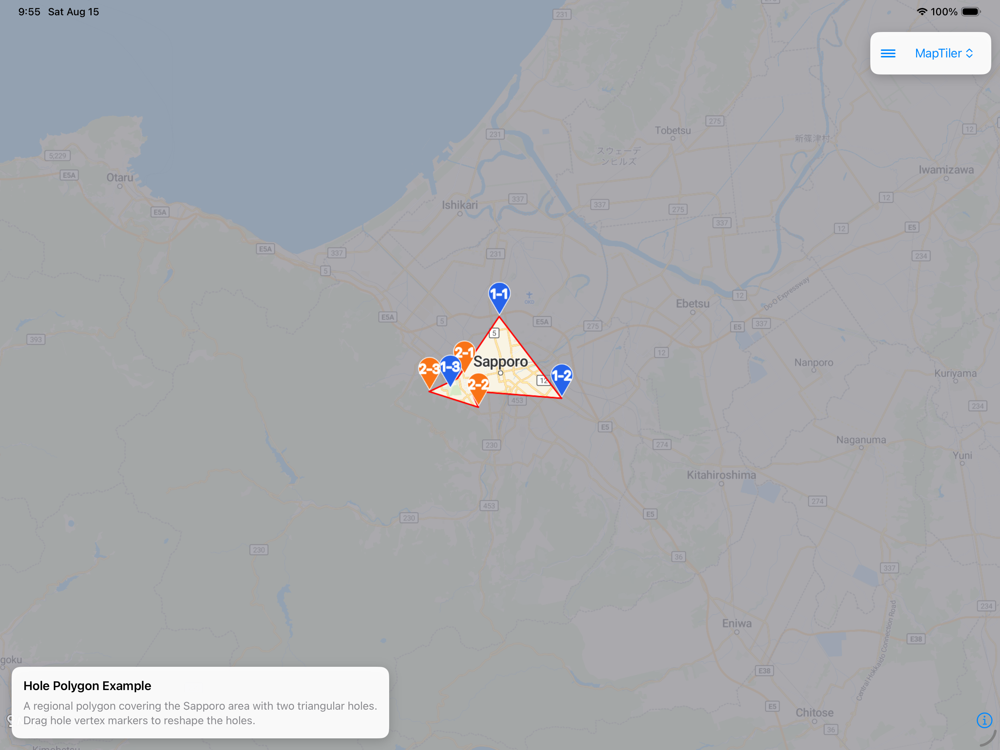

# MapTiler SDK for MapConductor iOS

## Description

MapConductor provides a unified API for iOS SwiftUI.
You can use MapTiler with SwiftUI, but you can also switch to other Maps SDKs (such as Mapbox, MapKit, and so on), anytime.
Even using the wrapper API, you can still access the native MapTiler view if you want.

## Setup

https://docs-ios.mapconductor.com/setup/maptiler/

## API key

MapTiler tiles require a [MapTiler Cloud](https://cloud.maptiler.com/) API key.
Provide it either per view or via `Info.plist`:

```swift
// Per view
MapTilerMapView(state: mapViewState, apiKey: "YOUR_MAPTILER_API_KEY")
```

```xml
<!-- Info.plist fallback (used when apiKey is nil) -->
<key>MapTilerAPIKey</key>
<string>YOUR_MAPTILER_API_KEY</string>
```

This mirrors android, which reads `MAPTILER_API_KEY` from the AndroidManifest.

## Usage

```swift
import SwiftUI
import MapConductorCore
import MapConductorForMapTiler

struct MapView: View {
    @StateObject private var mapViewState = MapTilerViewState(
        cameraPosition: MapCameraPosition(
            position: GeoPoint(latitude: 35.6762, longitude: 139.6503),
            zoom: 2
        )
    )
    @State private var selectedMarker: MarkerState? = nil

    let center = GeoPoint(latitude: 35.6762, longitude: 139.6503)

    var body: some View {
        MapTilerMapView(state: mapViewState) {
            Marker(
                position: center,
                icon: DefaultMarkerIcon(label: "Tokyo"),
                onClick: { state in selectedMarker = state }
            )
            if let selected = selectedMarker {
                InfoBubble(marker: selected) {
                    Text("Hello, world!")
                }
            }
        }
    }
}
```


## Components

### MapTilerMapView [[docs]](https://docs-ios.mapconductor.com/components/mapviewcomponent/)

```swift
struct MapExample: View {
    @StateObject private var mapViewState = MapTilerViewState(
        cameraPosition: MapCameraPosition(
            position: GeoPoint(latitude: 34.091, longitude: -117.886),
            zoom: 9,
            tilt: 60,
            bearing: 30
        )
    )

    var body: some View {
        MapTilerMapView(state: mapViewState)
    }
}
```


------------------------------------------------------------------------

### Marker [[docs]](https://docs-ios.mapconductor.com/components/marker/)

```swift
struct MarkerExample: View {
    @State private var markerState = MarkerState(
        position: GeoPoint(latitude: 35.6762, longitude: 139.6503),
        icon: DefaultMarkerIcon(label: "MapTiler"),
        onClick: { state in state.animate(.bounce) }
    )

    var body: some View {
        MapTilerMapView(state: mapViewState) {
            Marker(state: markerState)
        }
    }
}
```


------------------------------------------------------------------------

### InfoBubble [[docs]](https://docs-ios.mapconductor.com/components/infobubble/)

```swift
struct InfoBubbleExample: View {
    @State private var selectedMarker: MarkerState? = nil
    @State private var markerState = MarkerState(
        position: GeoPoint(latitude: 35.6762, longitude: 139.6503),
        onClick: { [self] state in selectedMarker = state }
    )

    var body: some View {
        MapTilerMapView(state: mapViewState) {
            Marker(state: markerState)
            if let selected = selectedMarker {
                InfoBubble(marker: selected) {
                    Text("Hello, world!")
                }
            }
        }
    }
}
```


------------------------------------------------------------------------

### Circle [[docs]](https://docs-ios.mapconductor.com/components/circle/)

```swift
struct CircleExample: View {
    var body: some View {
        MapTilerMapView(state: mapViewState) {
            Circle(
                center: GeoPoint(latitude: 35.6762, longitude: 139.6503),
                radiusMeters: 50,
                fillColor: UIColor.blue.withAlphaComponent(0.5),
                onClick: { state in
                    state.fillColor = UIColor.red.withAlphaComponent(0.5)
                }
            )
        }
    }
}
```


------------------------------------------------------------------------

### Polyline [[docs]](https://docs-ios.mapconductor.com/components/polyline/)

```swift
struct PolylineExample: View {
    var body: some View {
        MapTilerMapView(state: mapViewState) {
            Polyline(
                points: airports,
                strokeColor: UIColor.blue.withAlphaComponent(0.5),
                strokeWidth: 4,
                geodesic: true
            )
        }
    }
}
```


------------------------------------------------------------------------

### Polygon [[docs]](https://docs-ios.mapconductor.com/components/polygon/)

```swift
struct PolygonExample: View {
    var body: some View {
        MapTilerMapView(state: mapViewState) {
            Polygon(
                points: goryokaku,
                strokeColor: UIColor.blue.withAlphaComponent(0.5),
                fillColor: UIColor.red.withAlphaComponent(0.7)
            )
        }
    }
}
```


------------------------------------------------------------------------

### Polygon Hole

```swift
struct PolygonHoleExample: View {
    var body: some View {
        MapTilerMapView(state: mapViewState) {
            Polygon(
                points: outerPoints,
                holes: [innerPoints1, innerPoints2],
                fillColor: UIColor(red: 0.47, green: 0.47, blue: 0.50, alpha: 0.8),
                strokeColor: UIColor.red,
                strokeWidth: 2
            )
        }
    }
}
```


------------------------------------------------------------------------

### GroundImage [[docs]](https://docs-ios.mapconductor.com/components/groundimage/)

```swift
struct GroundImageExample: View {
    var body: some View {
        MapTilerMapView(state: mapViewState) {
            GroundImage(
                bounds: GeoRectBounds(
                    southWest: GeoPoint.fromLatLong(...),
                    northEast: GeoPoint.fromLatLong(...)
                ),
                image: uiImage,
                opacity: 0.5
            )
        }
    }
}
```

